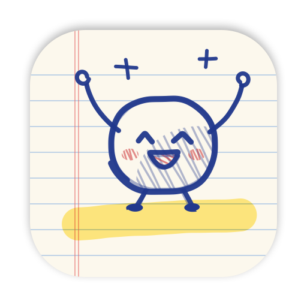

<p align="center">
  
</p>

<h1 align="center">Doodle Break</h1>

<p align="center">
  A hand-drawn menu bar companion that reminds you to get up from your desk.
</p>

<p align="center">
  
  
  
  
</p>

<p align="center">
  English | <a href="README.zh-CN.md">简体中文</a>
</p>

---

Doodle Break lives in your menu bar and tracks how long you have been sitting. When it is time to move, a notebook page drops onto your screen with a stretch suggestion and a short break timer. Everything, from the mascot to the buttons, is rendered in real time as ballpoint-pen doodles on lined paper.

<p align="center">
  
</p>

## Features

- **Menu bar countdown.** A hand-drawn ring shows the time left in the current sitting session, with the remaining minutes beside it.
- **A mascot with moods.** Doodle, the bean on the chair, goes from cheerful to sweaty to panicking as the session runs out. It jumps up and cheers during breaks and dozes off while the timer is paused.
- **Full-screen break page.** When the session ends, a taped notebook page appears on every display. It shows a random stretch (14 built in, shuffleable), a break countdown, and a snooze button whose copy gets more sarcastic each time you use it. Press <kbd>Esc</kbd> to snooze.
- **Accurate away detection.** Only a locked screen or a sleeping Mac counts as leaving your desk. Reading or watching a video without touching the keyboard does not reset the timer.
- **Survives restarts.** The session is saved to disk, so quitting, updating, or relaunching the app does not lose your progress.
- **Daily stats.** Stand-ups, snoozes, and your longest sitting streak for today, plus a seven-day history chart.
- **No dependencies.** Pure Swift and SwiftUI, built with Swift Package Manager. No network access and no analytics.

## Screenshots

| Sitting | On a break | Settings |
|:---:|:---:|:---:|
|  |  |  |

The six moods, from a fresh session to a paused timer:

<p align="center">
  
</p>

> The interface is currently in Simplified Chinese.

## Requirements

- macOS 14 Sonoma or later
- Xcode 15 or later, or the Xcode Command Line Tools (Swift 5.9+)

## Installation

Doodle Break is distributed as source. Build and install it with:

```bash
git clone https://github.com/canaanyjn/DoodleBreak.git
cd DoodleBreak
./build.sh
cp -R "build/Doodle Break.app" /Applications/
open "/Applications/Doodle Break.app"
```

`build.sh` compiles a release build, assembles the `.app` bundle, generates the app icon, and applies an ad-hoc code signature for local use.

On first launch, macOS asks for notification permission. Notifications are only used when the full-screen break page is turned off.

> **Using a menu bar manager** such as Ice or Bartender? New items may land in the hidden section. <kbd>⌘</kbd>-drag the icon into the visible area.

## How it works

### Sitting sessions

A session starts when you sit down and ends when you take a break. When the session length is reached, the break page appears. Finishing a break, clicking **刚动过** ("just moved"), or being away long enough all start a fresh session.

### Away detection

Doodle Break listens for exactly two system events:

| Event | Source |
|---|---|
| Screen locked and unlocked | `com.apple.screenIsLocked` and `com.apple.screenIsUnlocked` distributed notifications |
| System sleep and wake | `NSWorkspace` will-sleep and did-wake notifications |

If you are away longer than the configured threshold, your return counts as a stand-up and the timer resets. Shorter absences are ignored. Waking from sleep is only settled once the screen is unlocked. As a fallback, a large jump in wall-clock time is also treated as sleep.

Keyboard and mouse inactivity is deliberately ignored. The trade-off is that walking away without locking is not detected, so lock your screen with <kbd>⌃</kbd><kbd>⌘</kbd><kbd>Q</kbd> when you get up.

### Persistence

The current session is saved to `UserDefaults` whenever its state changes and every 15 seconds. On launch, the app resumes the saved session. If the app was not running for longer than the away threshold, that time counts as a stand-up instead.

A stand-up is only added to your stats when the preceding session lasted at least 5 minutes.

## Configuration

Open settings from the **设置** (Settings) link at the bottom of the popover.

| Setting | Default | Range |
|---|---|---|
| Session length | 45 min | 10 to 120 min |
| Break length | 3 min | 1 to 15 min |
| Away threshold (locked or asleep) | 4 min | 2 to 15 min |
| Snooze length | 5 min | 3 to 15 min |
| Full-screen break page | On | Off sends a system notification instead |
| Sound | On | |
| Countdown in the menu bar | On | |
| Open at login | Off | Requires the app to be in `/Applications` |

## Development

```bash
swift build          # debug build
./build.sh           # release build and .app bundle
```

The app binary accepts a few flags for development:

| Flag | What it does |
|---|---|
| `--selftest` | Runs 15 timer scenarios (restarts, locks, sleep, idle input, clock jumps) with simulated timestamps, then exits with a non-zero status on failure. Uses an isolated store. |
| `--preview <dir>` | Renders every screen offscreen to PNG files in `<dir>`, then exits. |
| `--demo-break` | Shows the break page immediately after launch. |
| `--diag` | Prints the app's own windows, including the status item, after two seconds. |

Set `DOODLE_FAST=1` to run one real second as one app minute. Fast mode stores its data separately, so it never touches your real stats.

```bash
"build/Doodle Break.app/Contents/MacOS/DoodleBreak" --selftest
DOODLE_FAST=1 "build/Doodle Break.app/Contents/MacOS/DoodleBreak"
```

### Project structure

```
Sources/DoodleBreak/
├── DoodleBreakApp.swift      App entry point, menu bar item, launch flags
├── SitTracker.swift          Session state machine, away detection, persistence, stats
├── SketchCore.swift          Hand-drawn stroke engine (CoreGraphics only, shared with the icon tool)
├── Sketch.swift              SwiftUI drawing helpers: ink strokes, paper, borders, highlighter, tape
├── Mascot.swift              The mascot, its chair, and six animated moods
├── Components.swift          Buttons, speech bubble, stat tiles, chart, countdown ring, settings controls
├── MenuPopover.swift         Menu bar popover and settings page
├── BreakOverlay.swift        Full-screen break page
├── OverlayController.swift   Break windows on every display, Esc to snooze
├── MenuBarIcon.swift         Template menu bar icon
├── Copy.swift                All user-facing text
├── Theme.swift               Colors, fonts, formatting
├── Support.swift             Sounds and notifications
├── SelfTest.swift            --selftest scenarios
└── PreviewRenderer.swift     --preview rendering
Tools/MakeIcon/main.swift     Draws the app icon and builds the .icns file
```

### The drawing engine

`SketchCore` turns clean geometry into ballpoint strokes. It resamples a path at even spacing and offsets each point with layered, seeded noise. Closed shapes start at a random point and overshoot their start, like a circle drawn by hand. Seeds keep every stroke stable between frames. The mascot cycles through three seeds five times a second, which produces the "line boil" of hand-drawn animation.

Handwriting uses Apple fonts: HanziPen SC, Hannotate SC, and Noteworthy. The first two are optional downloads you can install from Font Book. If a font is missing, the system font is used instead.
