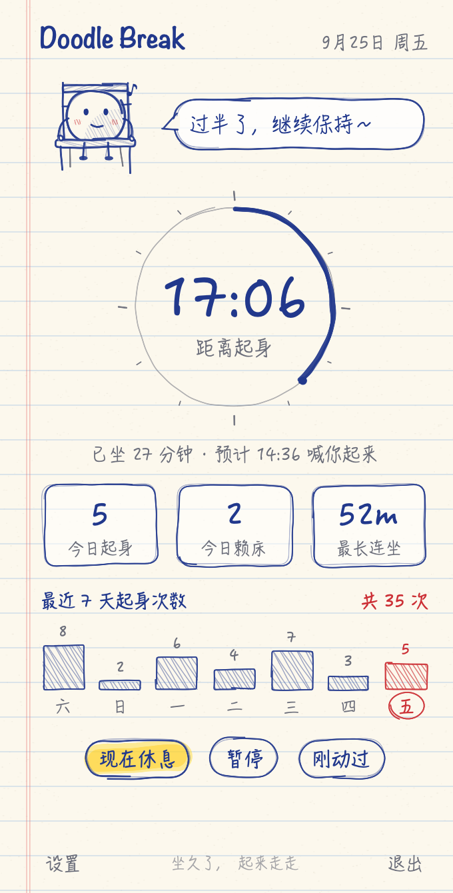
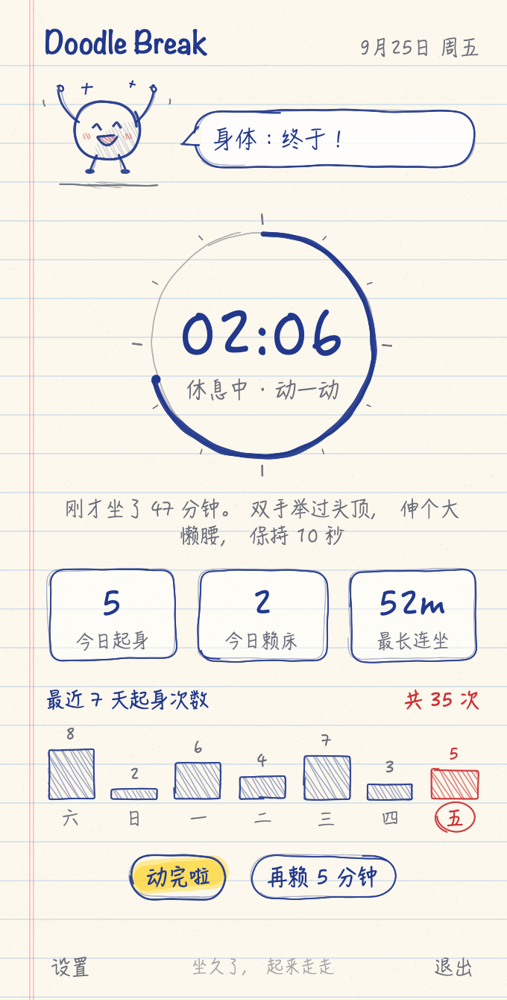
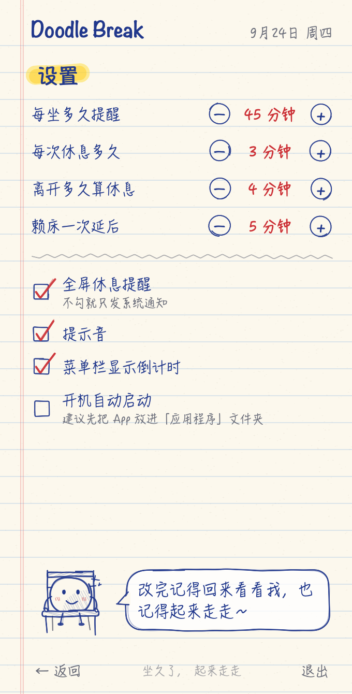
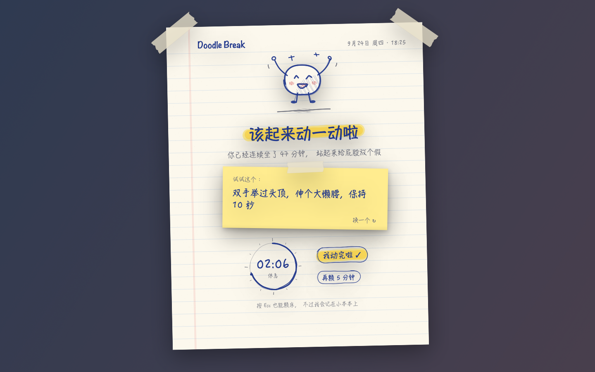
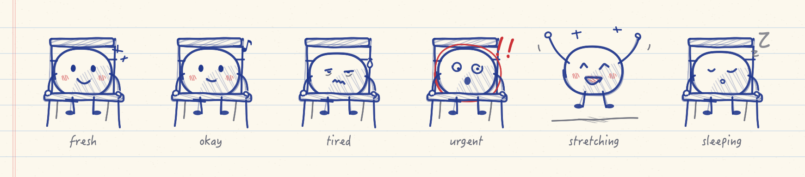

# Doodle Break · macOS 久坐提醒小助手

一个住在菜单栏里的小工具，整体画风是"笔记本纸 + 蓝色圆珠笔"：所有线条都是程序实时"手抖"出来的，吉祥物豆豆还会像逐帧手绘动画一样轻轻"抖线"。坐得越久，菜单栏的小圈被用掉得越多，豆豆也越蔫；到点后一页笔记本"啪"地贴到屏幕中央，逼你（温柔地）站起来。

## 长什么样

| 菜单栏弹窗 | 休息中 | 设置 |
|---|---|---|
|  |  |  |

全屏休息提醒：



豆豆的六种心情（刚坐下 → 过半 → 累了 → 快到点 → 休息中 → 暂停）：



## 它会做什么

- **菜单栏手画圆圈**：默认坐 45 分钟提醒一次，圆圈显示剩余时间，坐得越久圈越短，旁边显示剩余分钟数。
- **会变脸的豆豆**：坐在梯背椅上晃脚 → 哼歌 → 流汗撇嘴 → 红笔圈起来、眼珠乱转、冒出"!!" → 跳下椅子举手欢呼 → 趴着打瞌睡。气泡里的吐槽随心情变化。
- **全屏休息页**：一页贴着胶带的笔记本，荧光笔标题、便利贴上写着随机拉伸动作（14 条，可换）、圆珠笔倒计时圈。可以「我动完啦」提前结束，也可以「再赖 5 分钟」，每次赖床文案都更阴阳怪气一点。
- **离开判定只看锁屏和睡眠**：锁屏或电脑睡眠超过设定时长（默认 4 分钟），回来就算你起身过，计时重置。坐着看视频、看文档不碰键鼠不会被误判。离开时记得锁屏（⌃⌘Q）。
- **重启不丢进度**：计时状态会存盘，退出、重启、更新 App 后接着算；如果 App 关掉的时间超过设定时长，就当你离开过。
- **今日统计 + 最近 7 天柱状图**：柱子是圆珠笔涂出来的，今天用红笔圈出来。
- **可调设置**：提醒间隔、休息时长、离开判定时长、赖床时长、是否全屏、提示音、菜单栏倒计时、开机启动。

## 构建与安装

需要 macOS 14+ 和 Xcode（或 Command Line Tools）。

```bash
./build.sh
```

产物在 `build/Doodle Break.app`。试运行：

```bash
open "build/Doodle Break.app"
```

觉得好用就放进应用程序文件夹（开机启动功能需要 App 位置固定）：

```bash
cp -R "build/Doodle Break.app" /Applications/
```

手写字用的是 macOS 自带的翩翩体（HanziPen SC）和手札体（Hannotate SC）。如果别的 Mac 上没下载这两个字体，会自动退回系统字体，功能不受影响。

## 调试小技巧

- **加速模式**：`DOODLE_FAST=1 "build/Doodle Break.app/Contents/MacOS/DoodleBreak"`，1 秒当 1 分钟用，数据存在单独的偏好区，不会弄脏正式统计。
- **直接看休息界面**：`open "build/Doodle Break.app" --args --demo-break`
- **离屏渲染所有界面为 PNG**：`"build/Doodle Break.app/Contents/MacOS/DoodleBreak" --preview ./preview`
- **计时逻辑自测**：加 `--selftest`，用假时间模拟重启、锁屏、睡眠，逐条打印 PASS/FAIL，不碰真实数据。
- **自检**：加 `--diag`，2 秒后打印 App 自己的窗口（含状态栏图标窗口）并退出。
- **装了 Ice、Bartender 这类菜单栏管理器？** 新图标默认可能被收进隐藏区，按住 ⌘ 把它拖到可见区即可。

## 代码结构

```
Sources/DoodleBreak/
  SketchCore.swift        手抖笔触引擎：把规整路径变成圆珠笔线条、生成来回涂的阴影线（纯 CoreGraphics，图标脚本也在用）
  Sketch.swift            在 SwiftUI 里用笔画画：描线、涂色、横线纸、手画框、荧光笔、胶带、波浪线
  Theme.swift             纸笔配色、手写字体、时间格式化
  Mascot.swift            豆豆和它的椅子，六种心情 + 抖线动画
  Components.swift        手写按钮、对话气泡、统计框、柱状图、倒计时圈、手画步进器和勾选框
  MenuPopover.swift       菜单栏弹窗 + 设置页
  BreakOverlay.swift      全屏休息页（笔记本 + 便利贴）
  MenuBarIcon.swift       菜单栏手画小图标（模板图，自动适配深浅色菜单栏）
  SitTracker.swift        状态机：计时 / 休息 / 暂停 / 赖床 / 锁屏睡眠检测 / 重启续算 / 统计持久化
  OverlayController.swift 全屏窗口管理（多屏、Esc 赖床）
  Support.swift           提示音、系统通知
  SelfTest.swift          --selftest 计时逻辑自测
  Copy.swift              所有文案：拉伸建议、吐槽语录
  DoodleBreakApp.swift    App 入口
  PreviewRenderer.swift   --preview 离屏渲染
Tools/MakeIcon/main.swift 用同一套笔触画 App 图标并生成 .icns
```
